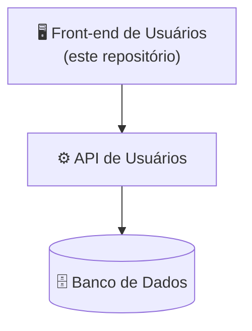

# 🖥️ VibeEco-Front-End-Users

<p align="center">
  <strong>Interface web dos usuários da plataforma VibeEco</strong>
</p>

---

## 📌 Sobre este repositório

Este repositório contém a **interface web utilizada pelos usuários** do VibeEco. Ela consome a **API de Usuários** e segue os protótipos de alta fidelidade da versão Desktop.

**Responsável:** Gabriel Sousa — [GitHub](https://github.com/GabrielsrMelo)

---

## 🏗️ Posição na arquitetura



API utilizada: [VibeEco-Back-End-Users](https://github.com/pedsousa06-ai/VibeEco-Back-End-Users)

---

## 🎯 Responsabilidades

- Implementação das telas dos protótipos;
- Implementação da identidade visual;
- Desenvolvimento dos componentes;
- Integração com a API de Usuários;
- Testes das interfaces;
- Correção e manutenção do Front-end.

---

## 🧩 Principais áreas

### 🔐 Acesso

- Login;
- Primeiro acesso;
- Recuperação de senha.

### 🏠 Plataforma

- Dashboard;
- Feed;
- Publicações e comentários;
- Missões e detalhes das missões;
- Desafios;
- Conteúdos educativos;
- Quiz.

### 🏆 Gamificação

- XP, níveis e Moedas Verdes;
- Conquistas;
- Ranking;
- Recompensas.

### 👤 Perfil

- Perfil;
- Histórico;
- Notificações;
- Configurações.

---

## 🎨 Identidade visual

- 🌱 Verde como cor principal;
- Tons claros, branco e tons neutros;
- Elementos relacionados à sustentabilidade;
- Interface moderna e limpa;
- Boa legibilidade e acessibilidade;
- Aparência profissional, evitando um visual excessivamente infantil.

Protótipos: <!-- TODO: colocar o link do Figma (Desktop) -->

---

## ⚙️ Como executar

<!-- TODO: informar tecnologias, versões e comandos reais -->

### Pré-requisitos

- `<Node.js / runtime e versão>`
- API de Usuários em execução

### Passos

```bash
# 1. Clonar o repositório
git clone https://github.com/pedsousa06-ai/VibeEco-Front-End-Users.git
cd VibeEco-Front-End-Users

# 2. Instalar as dependências
<comando de instalação>

# 3. Configurar as variáveis de ambiente
cp .env.example .env

# 4. Executar em modo de desenvolvimento
<comando de execução>
```

### Variáveis de ambiente

| Variável | Descrição |
|----------|-----------|
| `<API_URL>` | URL base da API de Usuários |

---

## 📁 Estrutura do projeto

<!-- TODO: ajustar conforme a estrutura real -->

```text
VibeEco-Front-End-Users
│
├── 📁 src
│   ├── 📁 components   # Componentes reutilizáveis
│   ├── 📁 pages        # Telas
│   ├── 📁 services     # Integração com a API
│   └── 📁 styles       # Identidade visual
└── 📄 README.md
```

---

## 🧪 Testes

- Testes das telas;
- Testes de navegação;
- Testes de integração com a API;
- Testes das funcionalidades;
- Testes de interface.

---

## 📊 Status

🚧 **Em desenvolvimento**

- [ ] Acesso (login, primeiro acesso, recuperação de senha)
- [ ] Dashboard e feed
- [ ] Missões, desafios, conteúdos e quiz
- [ ] Gamificação, ranking e recompensas
- [ ] Perfil, histórico, notificações e configurações
- [ ] Integração com a API
- [ ] Testes

---

## 🌱 Sobre o VibeEco

O **VibeEco** é uma plataforma digital desenvolvida pela **TechProton** para promover a conscientização e o engajamento em sustentabilidade, por meio de conteúdos educativos, missões, desafios, gamificação e interação social.

🔗 **Repositório principal:** [VibeEco](https://github.com/pedsousa06-ai/VibeEco)

### 📦 Repositórios do projeto

| Área | Repositório | Responsável |
|------|-------------|-------------|
| 🗄️ Banco de Dados | [VibeEco-DataBase](https://github.com/pedsousa06-ai/VibeEco-DataBase) | Ryller Feitosa |
| ⚙️ Back-end Usuários | [VibeEco-Back-End-Users](https://github.com/pedsousa06-ai/VibeEco-Back-End-Users) | Lucas Kolle |
| ⚙️ Back-end Administrativo | [VibeEco-Back-End-Adm](https://github.com/pedsousa06-ai/VibeEco-Back-End-Adm) | Lucas Kolle |
| 🖥️ Front-end Usuários | [VibeEco-Front-End-Users](https://github.com/pedsousa06-ai/VibeEco-Front-End-Users) | Gabriel Sousa |
| 🖥️ Front-end Administrativo | [VibeEco-Front-End-Adm](https://github.com/pedsousa06-ai/VibeEco-Front-End-Adm) | Gabriel Sousa |
| 📱 Mobile | [VibeEco-Mobile](https://github.com/pedsousa06-ai/VibeEco-Mobile) | Pedro Sousa |

---

## 📄 Licença

Este projeto foi desenvolvido pela equipe TechProton como parte do projeto VibeEco. Informações sobre licenciamento e distribuição deverão ser definidas pela equipe responsável pelo projeto.

## 👨‍💻 TechProton

| | |
|---|---|
| **Projeto** | VibeEco |
| **Empresa** | TechProton |
| **Categoria** | Tecnologia • Sustentabilidade • Educação |
| **Status** | Em desenvolvimento |
| **Início** | 10/08/2026 |
